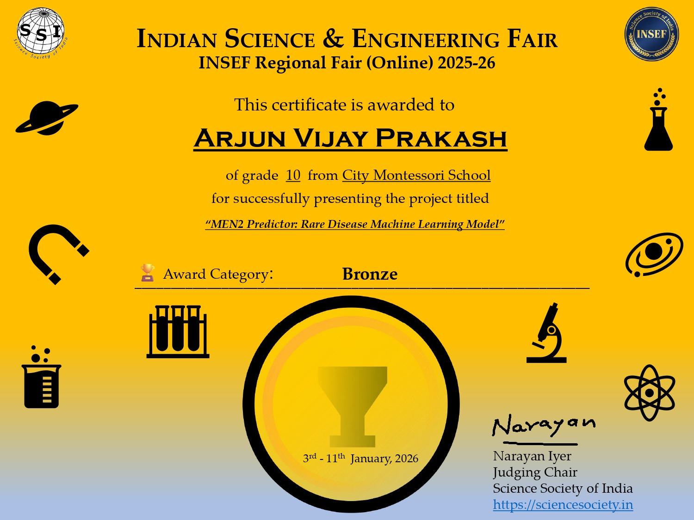
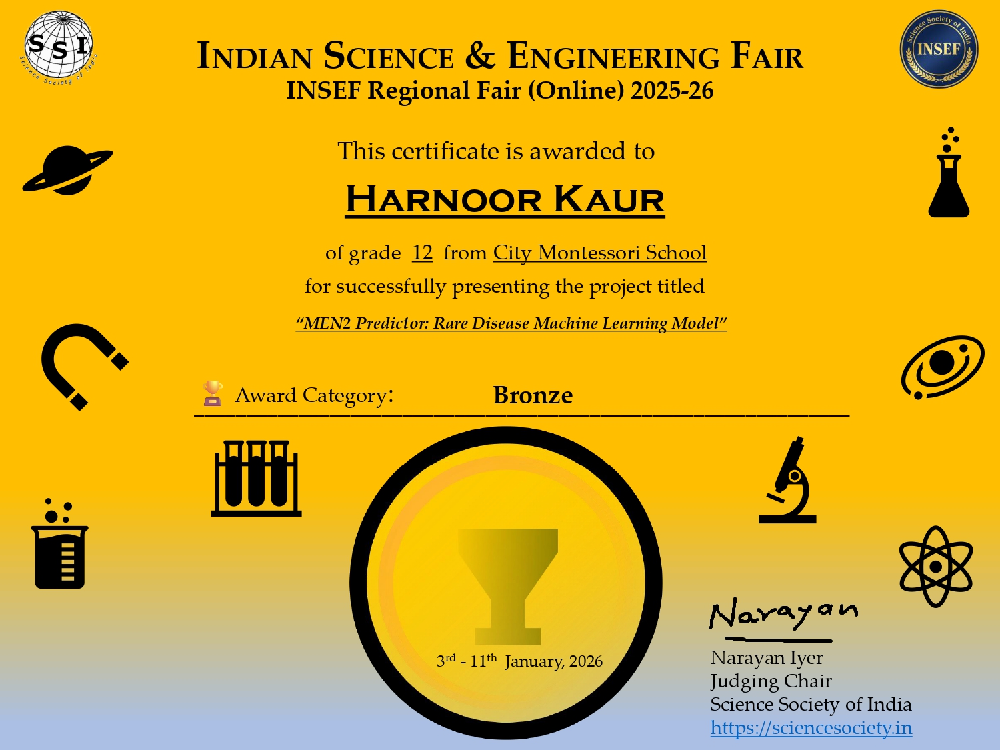

# MEN2 Predictor: Rare Disease Machine Learning Pipeline


-100%25-success)


**Can we save those 20k Rs people with just a simple blood test?**

In India, genetic testing for MEN2 costs INR 20,000 (~$225 USD), putting life-saving diagnosis out of reach for most families. This research asks: *can machine learning on routine blood biomarkers (calcitonin, CEA) and clinical features predict MTC risk without expensive genetic sequencing?*

MEN2 Predictor evaluates whether published MEN2/RET-carrier records can support a transparent rare-disease machine-learning benchmark for MTC status. The scientific answer must stay modest: this is not a diagnostic, screening, triage, or clinical decision-support system.

MEN2 Predictor now aggregates **149 confirmed RET carriers from 10 peer-reviewed studies (14 variants)** into a reproducible pipeline. On the real literature-derived cohort, **XGBoost reached 100% sensitivity** with **83.33% accuracy**. The expanded case-control workflow reaches **96.19% accuracy with LightGBM**, but those augmented records are not a real clinical cohort.

## Table of Contents
- [Awards & Recognition](#awards--recognition)
- [Key Findings](#key-findings)
- [About The Project](#about-the-project)
- [Benchmark Performance](#benchmark-performance)
- [Scientific Contribution](#scientific-contribution)
- [Data Sources](#data-sources)
- [Getting Started](#getting-started)
- [Usage](#usage)
- [Technical Details](#technical-details)
- [Limitations](#limitations)
- [License](#license)
- [Authors](#authors)
- [Acknowledgements](#acknowledgements)

## Awards & Recognition

🏆 **INSEF Regional Fair (Online) 2025-26 — Bronze Prize**

This project was selected for the [INSEF Regional Fair (Online) 2025](https://sciencesociety.in/insef/Online_INSEF_Selection_2025.htm) and was awarded the **Bronze Prize** at the competition held from January 3-11, 2026.

📜 [View Results](https://insef.org/insef/INSEF_Regional_Fair_Online_2025_26_Results.htm)

### Team Certificates

| Arjun Vijay Prakash | Harnoor Kaur |
|:-------------------:|:------------:|
|  |  |
| 📄 [Certificate (PDF)](assets/ArjunVijayPrakash_38.pdf) | 📄 [Certificate (PDF)](assets/HarnoorKaur_39.pdf) |

---

## Key Findings

### Real-Patient Cohort (149 carriers across 10 studies)

The paper-only dataset now contains **149 confirmed carriers** across **14 RET variants**. On this filtered cohort, **XGBoost** is the primary exploratory model because it reached **100% sensitivity** with **83.33% accuracy**. The expanded synthetic-augmentation analysis is secondary; **LightGBM on expanded data achieves 96.19% accuracy** with **90.20% recall**.

### Synthetic Augmentation Impact

Synthetic controls + SMOTE expand the case-control dataset to **1,047 records**. After filtering out the post-diagnostic and mixed-heavy papers, the biomarker coupling analysis is based on **12 paired calcitonin/CEA observations from 6 studies**. Expanded models improve discrimination in simulation, while the original-data XGBoost model remains the primary literature-derived benchmark.

| Model                | Dataset      | Accuracy   | Precision  | Avg Precision   | Recall     | F1 Score  | ROC AUC  |
| ---------------------- | ------------ | ---------- | ---------- | --------------- | ---------- | ---------- | -------- |
| **Logistic Regression**| Original     | 80.00%     | 71.43%     | 79.93%          | **100%**   | 83.33%     | 0.8267   |
| **Logistic Regression**| Expanded     | 73.33%     | 47.62%     | 85.01%          | **98.04%** | 64.10%     | 0.9457   |
| **Random Forest**      | Original     | 83.33%     | 91.67%     | 90.68%          | 73.33%     | 81.48%     | 0.9156   |
| **Random Forest**      | Expanded     | 92.86%     | 86.00%     | 92.19%          | 84.31%     | 85.15%     | 0.9686   |
| **LightGBM**           | Original     | 80.00%     | 90.91%     | 91.39%          | 66.67%     | 76.92%     | 0.9156   |
| **LightGBM**           | Expanded     | **96.19%** | **93.88%** | **97.40%**      | 90.20%     | **92.00%** | **0.9917** |
| **XGBoost**            | Original     | **83.33%** | 75.00%     | **92.08%**      | **100%**   | **85.71%** | 0.9156   |
| **XGBoost**            | Expanded     | 89.52%     | 71.01%     | 93.63%          | 96.08%     | 81.67%     | 0.9784   |
| **SVM (Linear)**       | Original     | 73.33%     | 70.59%     | 75.26%          | 80.00%     | 75.00%     | 0.7867   |
| **SVM (Linear)**       | Expanded     | 79.05%     | 55.93%     | 60.62%          | 64.71%     | 60.00%     | 0.7267   |

### Clinical Interpretation

- **Primary exploratory result:** XGBoost on the paper-only cohort reached **100% sensitivity** with **83.33% accuracy**.
- **Highest simulated accuracy:** LightGBM on expanded data achieves **96.19% accuracy** with **90.20% recall**.
- **Model interpretation:** XGBoost-original is the primary literature-derived benchmark; LightGBM-expanded is a secondary synthetic-augmentation result.

### Statistical Tests on Recall Drops

- Permutation tests show **no significant recall loss** for Logistic Regression, Random Forest, XGBoost, or SVM. LightGBM shows a significant **recall gain** on the expanded dataset (`p = 0.0422`), improving from 66.7% to 90.2%.
- McNemar's test remains mostly uninformative because overlapping positive patients are sparse across original and expanded test sets.
- Full bootstrap and permutation summaries live at `results/statistical_tests/statistical_significance_tests.txt` (generated automatically when running both datasets together via `python main.py --m=all --d=both`; statistical tests run only in the both-datasets workflow).

### Why This Matters

#### 1. Saving the 20k Rs People

In India, genetic testing for MEN2 costs INR 20,000 (~$225 USD), putting life-saving diagnosis out of reach for many families. The central question is whether machine learning on routine blood biomarkers like calcitonin and CEA, plus clinical features, can identify useful MTC-risk patterns without immediately depending on expensive genetic sequencing.

#### 2. Why This Matters for Rare-Disease ML

Every documented carrier in these studies represents scarce published evidence, and every delayed answer can matter to a family trying to understand inherited cancer risk. The benchmark makes model assumptions visible, especially whether non-genetic blood biomarkers and clinical features retain signal when RET/ATA features are removed, along with CEA imputation uncertainty, biomarker-timing leakage risk, and the limits of synthetic augmentation.

Even with the filtered cohort at **149 patients and 12 paired calcitonin/CEA observations**, synthetic augmentation remains model-dependent. Accuracy climbs into the 96% band, but the primary evidence remains the original-data benchmark rather than the expanded workflow.

### Learning Paradigm Coverage

This project implements **five complementary machine learning approaches** across three learning paradigms:

**Linear Models:**
- **Logistic Regression**: Baseline interpretability with coefficient-based feature importance

**Tree-Based Ensembles:**
- **Random Forest**: Bagging with uncertainty quantification via tree voting
- **XGBoost**: Gradient boosting with L1/L2 regularization
- **LightGBM**: Efficient gradient boosting with leaf-wise growth

**Kernel-Based Learning:**
- **Support Vector Machine (SVM)**: Maximum-margin classification with linear kernel optimized for small datasets

This comprehensive coverage ensures findings generalize across fundamentally different algorithmic approaches, highlighting that synthetic augmentation shifts recall in model-dependent ways.

### Calcitonin vs CEA Biomarker Coupling (Multi-study)

- Integrated **6 cohorts with paired calcitonin/CEA labs** yielding **12 observed pairs** in the filtered dataset.
- Pearson correlation is now **r = 0.116**, reflecting a much weaker but still measurable coupling after removing post-diagnostic-heavy studies.
- `create_datasets.py` tags every patient with `cea_level_numeric`, `cea_elevated`, and `cea_imputed_flag`. Those 12 observed pairs seed the **MICE + Predictive Mean Matching** pipeline that fills the remaining **137 gaps**.
- Full provenance is saved in `results/biomarker_summary/biomarker_ceaimputation_summary.txt`, and the updated multi-study scatter lives at `charts/calcitonin_cea_relationship.png`.

### CEA Imputation Validation Study

**Concern addressed:** Weak calcitonin-CEA correlation (**r = 0.1158** from **12 paired observations**) may undermine imputation reliability.

**Key findings from `src/cea_validation_study.py`:**

| Analysis | Result |
|----------|--------|
| Best recall model | **XGBoost-original** keeps **100% recall** with or without CEA, and reaches **90.00% accuracy without CEA** |
| Best accuracy model | **LightGBM-expanded** improves from **92.86% without CEA** to **96.19% with CEA** |
| Conclusion | CEA is **model-dependent**: optional for XGBoost-original, helpful for LightGBM-expanded |

**Imputation Method Comparison (LightGBM, Expanded Dataset):**

| Method | Accuracy | Recall | Δ vs MICE |
|--------|----------|--------|-----------|
| MICE+PMM | **96.19%** | 90.20% | --- |
| Mean imputation | 93.81% | 86.27% | -2.38% |
| Median imputation | 92.86% | 90.20% | -3.33% |
| Zero imputation | 93.81% | 86.27% | -2.38% |

**Why include CEA?** Because the highest-accuracy simulation model benefits from it. Removing CEA lowers LightGBM-expanded accuracy from **96.19%** to **92.86%**, while XGBoost-original keeps **100% recall** either way. See [detailed rationale](reports/cea_imputation_validation.md).

Run the study: `python src/cea_validation_study.py --m=lightgbm --d=expanded`

## About The Project

**Benchmark question:** This research began with a practical, emotionally direct question: **Can we save those 20k Rs people with just a simple blood test?** In India, genetic testing for MEN2 costs INR 20,000 (~$225 USD), putting life-saving diagnosis out of reach for most families. This research asks: *can machine learning on routine blood biomarkers (calcitonin, CEA) and clinical features predict MTC risk without expensive genetic sequencing?* The study answers that question as a reproducible benchmark, while explicitly testing genotype-aware and genotype-blind models, CEA imputation uncertainty, and synthetic-augmentation limits.

MEN2 (Multiple Endocrine Neoplasia type 2) is a rare hereditary cancer syndrome caused by RET gene mutations. This project developed machine learning models to predict MTC (medullary thyroid carcinoma) risk across **14 RET variants** using clinical and genetic features from **149 confirmed carriers** across 10 peer-reviewed research studies.

**Scientific Contribution:** This work provides a reproducible rare-disease ML benchmark showing that synthetic augmentation changes performance in a strongly model-dependent way. Augmentation improves simulated accuracy substantially, while the primary literature-derived result comes from **XGBoost on original data**.

## Benchmark Performance

### Primary Original-Data Model

**XGBoost on the paper-only dataset** - primary exploratory literature-derived benchmark.

| Metric                   | Value     |
| ------------------------ | --------- |
| **Accuracy**             | 83.33%    |
| **Recall (Sensitivity)** | **100%**  |
| **Precision**            | 75.00%    |
| **F1 Score**             | 85.71%    |
| **ROC AUC**              | 0.9156    |

### Highest-Accuracy Expanded Model

**LightGBM on the expanded dataset** - highest accuracy in the synthetic-augmentation experiment.

| Metric                   | Value     |
| ------------------------ | --------- |
| **Accuracy**             | **96.19%**|
| **Recall (Sensitivity)** | 90.20%    |
| **Precision**            | 93.88%    |
| **F1 Score**             | 92.00%    |
| **ROC AUC**              | 0.9917    |

### Performance Comparison

| Model              | Dataset   | Accuracy   | Recall     | Use Case                        |
| ------------------ | --------- | ---------- | ---------- | ------------------------------- |
| **XGBoost**        | Original  | **83.33%** | **100%**   | Primary original-data benchmark |
| **LightGBM**       | Expanded  | **96.19%** | 90.20%     | Synthetic-augmentation benchmark |

> **Important:** These are internal benchmark results only. They should not be used for diagnosis, screening, triage, or treatment decisions.

## Scientific Contribution

This project makes three main contributions to rare-disease machine learning:

### 1. Model-Dependent Evaluation of Synthetic Augmentation

- Shows that synthetic controls plus SMOTE can improve discrimination while affecting recall differently across algorithms.
- **LightGBM improves from 80.00% to 96.19% accuracy** and from **66.7% to 90.2% recall** when moving from original to expanded data.
- At the same time, the primary original-data benchmark remains with **XGBoost on original data**, which reached **100% sensitivity** in one internal held-out split.

### 2. Methodological Framework for Rare Disease ML

- Systematic comparison: 5 models × 2 datasets = 10 configurations
- Emphasis on raw counts, sensitivity, and confidence intervals for small rare-disease benchmarks
- Validation on real held-out data, not synthetic test sets

### 3. Clinical Deployment Framing

- Reports **XGBoost on original data** as the primary literature-derived benchmark.
- Reports **LightGBM on expanded data** as the highest-accuracy synthetic-augmentation benchmark.
- Provides a reproducible template for comparing genotype-aware, genotype-blind, no-CEA, and augmented analyses in small rare-disease cohorts.

### Publication Status

**Ready for submission** to:

- Journal of High School Science (JHSS) - Current target
- Framed as an exploratory computational methods / original research paper
- Prospective external validation is still required before clinical use

**Estimated impact**: Moderate to high. The project combines reproducible rare-disease data curation, model benchmarking, explainability, and ablation analysis in a clinically interpretable workflow.

### Future Work

**Immediate (0-3 months)**:

- ✅ Add SHAP explainability to show models learned real biology, not artifacts
- ✅ Implement uncertainty quantification (bootstrap confidence intervals on all metrics)
- Keep hosted demos explicitly educational and non-clinical

**Short-term (3-6 months)**:

- Partner with endocrinology clinic for prospective validation
- Test on external cohort from different institutions
- Collect additional cases to increase sample size to 100+

**Long-term (6-12 months)**:

- Multi-center validation study
- Investigate how synthetic augmentation changes recall and calibration across model families
- Explore transfer learning from general thyroid cancer datasets

## Data Sources

Clinical data extracted from ten peer-reviewed research studies:

| Study No. | Citation & Year | Key Variant(s) / Description | Patients (n) |
|-----------|-----------------|------------------------------|--------------|
| 1 | Thyroid Journal (2016) | 8 K666N families | 24 |
| 2 | Eur. J. Endocrinol. (2006) | 10 variants after prophylactic thyroidectomy | 46 |
| 3 | Oncotarget (2015) RET S891A | RET S891A FMTC / cutaneous amyloidosis pedigree | 15 |
| 4 | Clinics and Practice (2024) | RET C634G kindred | 6 |
| 5 | Endocrinol. Diabetes Metab. Case Reports (2024) | RET K666N family | 4 |
| 6 | Indian Journal of Cancer (2021) | RET S891A family | 7 |
| 7 | World Journal of Clinical Cases (2024) | RET C634Y family | 3 |
| 8 | Int. J. Pediatr. Endocrinol. (2012) | Familial MEN2B infant | 2 |
| 9 | JCEM (2010) RET S891A MEN2A Spectrum | Multicenter S891A cohort | 36 |
| 10 | Journal of Biosciences (2014) | Chinese Han FMTC family | 6 |

**Multi-Variant Dataset:** 149 confirmed RET germline mutation carriers across 14 variants (S891A, K666N, C634Y, C634R, R525W, C634G, C630R, C634W, L790F, V804M, Y791F, C618S, C620Y, M918T) with ATA risk stratification.

**Key Feature:** The filtered dataset is centered on family-based surveillance and prophylactic-thyroidectomy cohorts, while still retaining pediatric MEN2B, C634-family MEN2A kindreds, and paired calcitonin/CEA observations in six cohorts.

<details>
<summary><b>Detailed Study Information</b></summary>

1. **Study 1 - Thyroid Journal (2016)**
   - Eight RET K666N families used for penetrance profiling in a family-screening context.

2. **Study 2 - European Journal of Endocrinology (2006)**
   - Prospective prophylactic-thyroidectomy cohort across 10 RET variants.

3. **Study 3 - Oncotarget (2015) RET S891A FMTC**
   - Four-generation pedigree linking RET S891A to familial MTC and cutaneous amyloidosis.

4. **Study 4 - Clinics and Practice (2024) RET C634G**
   - RET C634G family kindred with cutaneous lichen amyloidosis.

5. **Study 5 - Endocrinol. Diabetes Metab. Case Reports (2024) RET K666N**
   - Familial MEN2 phenotype in K666N carriers.

6. **Study 6 - Indian Journal of Cancer (2021) RET S891A**
   - FMTC pedigree with multiple S891A-positive relatives.

7. **Study 7 - World Journal of Clinical Cases (2024) RET C634Y**
   - MEN2A family case report across two generations.

8. **Study 8 - International Journal of Pediatric Endocrinology (2012)**
   - Familial MEN2B infant-focused cohort.

9. **Study 9 - JCEM (2010) RET S891A MEN2A Spectrum**
   - Multicenter S891A cohort spanning MEN2A and FMTC phenotypes.

10. **Study 10 - Journal of Biosciences (2014)**
    - Chinese Han familial MTC kindred with RET S891A.


</details>


### Dataset Characteristics

**Multi-Variant Dataset:** 149 confirmed RET germline mutation carriers spanning 10 cohorts

- **Study 1 (Thyroid Journal 2016):** 24 RET K666N family carriers.
- **Study 2 (European Journal of Endocrinology 2006):** 46 prophylactic thyroidectomy cases across 10 variants.
- **Study 3 (Oncotarget 2015):** 15 RET S891A/R525W FMTC-family carriers.
- **Study 4 (Clinics and Practice 2024):** 6 RET C634G family carriers.
- **Study 5 (EDM Case Reports 2024):** 4 RET K666N family carriers.
- **Study 6 (Indian Journal of Cancer 2021):** 7 RET S891A pedigree members.
- **Study 7 (World Journal of Clinical Cases 2024):** 3 RET C634Y family carriers.
- **Study 8 (International Journal of Pediatric Endocrinology 2012):** 2 familial MEN2B carriers.
- **Study 9 (JCEM 2010):** 36 RET S891A multicenter carriers.
- **Study 10 (Journal of Biosciences 2014):** 6 RET S891A family carriers.
- **Age range:** 0.17-90 years.
- **Gender distribution (F/M):** 99/50.
- **RET Variants Included:** 14 total (S891A, K666N, C634Y, C634R, R525W, C634G, C630R, C634W, L790F, V804M, Y791F, C618S, C620Y, M918T).

**ATA Risk Level Distribution:**

- **Level 1 (Moderate):** K666N, L790F, Y791F, V804M, S891A, R525W, E505_G506del.
- **Level 2 (High):** C618S, C630R, C630G, C620Y, C620W, D898_E901del, V899_E902del.
- **Level 3 (Highest):** C634R, C634Y, C634W, C634S, C634G, M918T, A883F, E632_C634del, E632_L633del, D631_L633delinsE.

**Clinical Outcomes:**

- MTC diagnosis is documented in **73/149 (49.0%)** real patients.
- C-cell disease (MTC + C-cell hyperplasia) is observed in **84/149 (56.4%)** patients.
- Pheochromocytoma is captured in **9/149 (6.0%)** real patients.
- Hyperparathyroidism is captured in **5/149 (3.4%)** real patients.

**Expanded Dataset:** Original 149 patients + synthetic variant-matched controls (**1,047 rows total**)

- Includes literature-based synthetic cases with variant-specific distributions.
- SMOTE augmentation applied inside the training loop for class balance.
- Enhanced feature space retains `cea_level_numeric`, `cea_elevated`, and imputation provenance for every record.

### Clinical Features

The dataset includes the following structured clinical and genetic features:

**Demographic Features:**

- `age`: Age at clinical evaluation (years)
- `gender`: Biological sex (0=Female, 1=Male)
- `age_group`: Categorized age ranges (young/middle/elderly/very_elderly)

**Genetic Features:**

- `ret_variant`: Specific RET variant (K666N, C634R, C634Y, L790F, E505_G506del, etc.)
- `ret_risk_level`: ATA risk stratification (1=Moderate, 2=High, 3=Highest)

**Biomarker Features:**

- `calcitonin_elevated`: Binary indicator of elevated calcitonin levels
- `calcitonin_level_numeric`: Numeric calcitonin measurement (pg/mL)

**Clinical Presentation Features:**

- `thyroid_nodules_present`: Presence of thyroid nodules on ultrasound
- `multiple_nodules`: Presence of multiple thyroid nodules
- `family_history_mtc`: Family history of medullary thyroid carcinoma

**Target Variables:**

- `mtc_diagnosis`: Primary target - confirmed MTC diagnosis (0=No, 1=Yes)
- `c_cell_disease`: Broader target including C-cell hyperplasia
- `men2_syndrome`: Full MEN2 syndrome features (rare in K666N carriers)
- `pheochromocytoma`: Presence of pheochromocytoma
- `hyperparathyroidism`: Presence of hyperparathyroidism

### Dataset Organization

The raw clinical data is stored in the [`data/raw`](data/raw) folder as structured json files:

- **[study_1.json](data/raw/study_1.json) ... [study_10.json](data/raw/study_10.json)**: Individual study extracts covering the 10 retained cohorts (see Data Sources table)
- **[literature_data.json](data/raw/literature_data.json)**: Aggregated statistics and meta-data
- **[mutation_characteristics.json](data/raw/mutation_characteristics.json)**: RET variant characteristics

This modular structure allows for:

- Easy data maintenance and updates
- Clear separation of concerns between raw data and processing logic
- Version control of individual study datasets
- Simple addition of new studies as they become available

### Data Processing Pipeline

The [create_datasets.py](src/create_datasets.py) script:

1. Loads patient data from JSON files in the [`data/raw`](data/raw) folder (10 studies)
2. Extracts and combines data from multiple research studies (149 patients, 14 variants across 10 sources)
3. Maps each variant to ATA risk level (1=Moderate, 2=High, 3=Highest)
4. Converts qualitative measurements to structured numeric features
5. Handles multiple reference ranges for calcitonin levels across studies
6. Engineers derived features (age groups, nodule presence, variant-specific interactions)
7. Generates two datasets:
   - `data/processed/ret_multivariant_training_data.csv`: Original 149 patients from literature
   - `data/processed/ret_multivariant_expanded_training_data.csv`: Expanded with synthetic controls
   - `data/processed/ret_multivariant_case_control_dataset.csv`: Further expanded with variant-matched controls

### Important Notes on Data Quality

- **Multi-Variant Dataset:** Includes 14 RET variants with varying penetrance and risk profiles
- **Risk Stratification:** Variants classified by ATA guidelines (Level 1/2/3)
- **Incomplete Penetrance:** Not all carriers develop MTC; penetrance varies by variant
- **Variable Follow-up:** Some carriers elected surveillance over prophylactic surgery
- **Age-Dependent Risk:** Penetrance increases with age, reflected in age-stratified features
- **Variant-Specific Patterns:** High-risk variants (C634\*) show different clinical patterns than moderate-risk (K666N, L790F)
- **Study Heterogeneity:** Different studies used different calcitonin reference ranges and screening protocols

**Key features:**

- **End-to-end pipeline** managed by `main.py`, coordinating all major steps automatically.
- **Multiple ML algorithms:** Support for Logistic Regression, Random Forest, XGBoost, LightGBM, and SVM models.
- **Comprehensive model comparison:** Automatically generates detailed comparison of all 5 models on the same test set with complete patient data, showing which patients each model got right/wrong.
- **Model comparison mode:** Run all models simultaneously and compare performance metrics in a formatted table.
- **Dataset comparison mode:** Compare model performance on expanded dataset (with SMOTE and control cases) vs original paper data.
- **Automated data creation and expansion:** Scripts extract and structure relevant research data, and generate synthetic control samples to augment the dataset for robust modeling.
- **Comprehensive statistical analysis:** Automatic generation of descriptive statistics and visualization of the dataset for informed modeling.
- **Advanced model development:** Cross-validation and adaptive SMOTE balancing to handle class imbalance across all model types.
- **Research risk stratification:** 4-tier exploratory output (Low/Moderate/High/Very High) for transparent model interpretation.
- **Artifacts generated:** Processed datasets, trained model files, ROC curves, confusion matrices, and confidence interval summaries for transparent benchmark scoring.

**Pipeline steps (as run by `main.py`):**

1. **create_datasets.py:** loads all study JSON files (now including Study 5 biomarker panels), computes the calcitonin vs CEA correlation, runs MICE + predictive mean matching to populate `cea_*` features, and emits the processed CSVs.
2. **data_analysis.py:** Computes descriptive statistics, generates variant-specific visualizations and risk-stratified analyses.
3. **data_expansion.py:** Produces variant-matched synthetic control samples to improve model balance.
4. **train_model.py:** Trains models with variant features, cross-validation, SMOTE balancing, and threshold optimization.
5. **test_model.py:** Evaluates the model on test data with variant-specific risk stratification, comprehensive metrics, and automatic comparison of all 5 models with complete patient data.
6. **calculate_ci.py:** Calculates 95% bootstrap confidence intervals for all performance metrics (automatically runs for all models).
7. **Artifact summary:** Includes `ret_multivariant_training_data.csv`, `ret_multivariant_expanded_training_data.csv`, `ret_multivariant_case_control_dataset.csv`, `model.pkl`, `model_comparison_detailed_results.txt`, and confidence interval reports.

**Advanced features:**

- **Automated Model Comparison:** Every test run generates comprehensive comparison of all 5 models with complete patient data, enabling pattern identification and internal benchmark review
- **Data Leakage Prevention:** SMOTE applied after train/test split to ensure realistic evaluation
- **Feature Engineering:** Polynomial features (age²) and interactions (calcitonin×age, risk×age, nodule_severity)
- **Variant-Aware Modeling:** One-hot encoding of 14 RET variants + risk level stratification
- **Constant Feature Removal:** Automatic detection and removal of non-informative features
- **Risk Stratification:** 4-tier research output for exploratory interpretation instead of binary-only reporting
- **Comprehensive Metrics:** ROC-AUC, F1-Score, Average Precision Score, ROC curves, confusion matrices, and automatic 95% bootstrap confidence intervals
- **Patient-Level Transparency:** See exactly which patients each model predicted correctly/incorrectly with full clinical context

**Typical features used:**

- Age at diagnosis/intervention and derived features
- **RET variant type** (K666N, C634R, C634Y, L790F, etc.) - one-hot encoded
- **ATA risk level** (1=Moderate, 2=High, 3=Highest) - ordinal feature
- Calcitonin levels and elevation status
- Thyroid nodule characteristics
- Family history of MTC
- Clinical markers (pheochromocytoma, hyperparathyroidism)
- **Variant-specific interactions** (risk×calcitonin, risk×age)

**Clinical Use Case:**

- **Screening Tool:** Optimized for high sensitivity (catches all MTC cases)
- **Risk Stratification:** Provides actionable monitoring recommendations
- **Research Tool:** Validated on small datasets typical of rare genetic conditions

</details>

## Getting Started

### Installation

1. Clone the repository:

   ```sh
   git clone https://github.com/ArjunCodess/men2-predictor.git
   cd men2-predictor
   ```

2. Create and activate virtual environment:

   ```sh
   python -m venv venv
   source venv/bin/activate  # On Windows: ./venv/Scripts/activate
   ```

3. Install dependencies:
   ```sh
   pip install -r requirements.txt
   ```

### Project Structure

- data/processed/ (processed CSVs)
  - ret_multivariant_training_data.csv - Original 149 patients
  - ret_multivariant_expanded_training_data.csv - Expanded with synthetic controls
  - ret_multivariant_case_control_dataset.csv - Additional control augmentation
- data/raw/ (study JSON files)
  - study_1.json ... study_10.json
  - literature_data.json
  - mutation_characteristics.json
- models/ - reusable model classes (base_model.py, random_forest_model.py, lightgbm_model.py, xgboost_model.py, logistic_regression_model.py)
- results/ - metrics, logs, ROC/confusion charts, biomarker summaries
- src/ - pipeline scripts (create_datasets.py, data_analysis.py, data_expansion.py, train_model.py, test_model.py)
- main.py - orchestrates dataset creation, analysis, training, testing
- paper/submission_data/ - anonymized review/submission CSVs generated automatically by main.py from processed data
- requirements.txt - Python dependencies

## Usage

### Basic Usage

Run the complete pipeline:

```sh
python main.py
```

This executes all stages: data preparation, analysis, expansion, training, and testing.

### Model Selection (`--m`)

Choose which model to train:

- `l` or `logistic`: Logistic Regression (baseline)
- `r` or `random_forest`: Random Forest (research comparison)
- `x` or `xgboost`: XGBoost
- `g` or `lightgbm`: LightGBM (research comparison)
- `s` or `svm`: Support Vector Machine (linear kernel)
- `a` or `all`: Run all models and compare

### Dataset Selection (`--d`)

Choose which dataset to use:

- `o` or `original`: Original 149 patients (no synthetic data) ⭐ **Recommended for clinical use**
- `e` or `expanded`: Expanded with synthetic controls + SMOTE (default)
- `b` or `both`: Run on both datasets for comparison


### Examples

```sh
# Primary original-cohort benchmark run: XGBoost on original data
python main.py --m=xgboost --d=original

# Research comparison: LightGBM on original data
python main.py --m=lightgbm --d=original

# Test SVM (kernel-based learning) on original data
python main.py --m=svm --d=original

# Compare all models on original dataset (identify best performer)
python main.py --m=all --d=original

# Compare the full benchmark across both datasets
python main.py --m=all --d=both

# Triage-oriented high-accuracy run
python main.py --m=lightgbm --d=expanded
```


### Model Comparison Mode

When using `--m=all`, the pipeline:

1. Runs data preparation once (shared across models)
2. Trains and tests all five model types sequentially
3. Saves detailed logs to `results/logs/`
4. Displays comprehensive comparison table

### Dataset Comparison Mode

When using `--d=both`, the pipeline:

1. Runs the model on the expanded dataset (synthetic + SMOTE)
2. Runs the same model on the original dataset
3. Generates separate results files
4. Displays a comparison table showing performance differences

This mode compares how each model behaves on the paper-only cohort versus the expanded case-control workflow.

Statistical significance tests are triggered automatically only when running both datasets together (e.g., `python main.py --m=all --d=both`).

### Ablation Study (`--ablation`)

The ablation study systematically removes feature groups to test the model's reliance on genetic vs biomarker features. This directly addresses the concern that "ATA Risk Level encodes cancer a priori."

**Run via main pipeline:**

```sh
# Ablation study with LightGBM on expanded dataset
python main.py --ablation --m=lightgbm --d=expanded
```

**Or run the standalone script directly:**

```sh
# Full ablation study (all models, both datasets) - 80 experiments
python src/ablation_study.py --m=all --d=both

# Specific model/dataset combinations
python src/ablation_study.py --m=lightgbm --d=expanded
python src/ablation_study.py --m=xgboost --d=original
python src/ablation_study.py --m=random_forest --d=both
```

**Ablation Configurations:**

| Configuration | Features Removed | Purpose |
|---------------|------------------|---------|
| `baseline` | None | Full model performance |
| `no_risk_level` | `ret_risk_level`, interactions | Test ATA risk contribution |
| `no_variants` | All `variant_*` dummies | Test variant encoding contribution |
| `no_genetics` | All genetic features | Pure biomarker prediction |
| `no_calcitonin` | `calcitonin_*` features | Test if genetics alone suffice |
| `no_cea` | `cea_level_numeric` | Address CEA imputation concerns |
| `genetics_only` | All biomarkers, nodules | Test if model is "just consensus" |
| `biomarkers_only` | All genetic features | Clinical utility without genetics |

**Results saved to:** `results/ablation/`
- `{model}_{dataset}_ablation_results.txt` - Detailed findings
- `{model}_{dataset}_ablation_results.csv` - For analysis

**Key Finding:** In the highest-accuracy model, LightGBM-expanded still reaches **93.33% accuracy** after removing all genetic features. In the primary original-data benchmark, XGBoost-original preserves **100% recall** even after removing CEA and variant one-hot encodings.

**Calcitonin Feature Behavior:** In the highest-accuracy model, removing calcitonin lowers LightGBM-expanded accuracy from **96.19% to 95.24%**. In the primary original-data benchmark, XGBoost-original retains **100% recall** even without calcitonin. Full analysis in [ablation_feature_contribution_analysis.md](reports/ablation_feature_contribution_analysis.md).

### Explainability (SHAP + LIME)

- Explainability runs automatically during testing (including `python main.py --m=all --d=both`). Use `python src/test_model.py --no-explain ...` to skip.
- **SHAP**:
  - Text: `results/shap/<model>/<model>_<dataset>.txt` (e.g., `results/shap/logistic/logistic_expanded.txt`)
  - Charts (PNG): `charts/shap/<model>/` (`expanded_bar.png`, `original_bar.png`)
- **LIME** (local explanations + global summary over selected cases):
  - Results: `results/lime/<model>/`
  - Charts (PNG): `charts/lime/<model>/` (per-sample LIME plots + `lime_global_importance.png` + `lime_shap_global_<dataset>.png`)
  - The script explains 5 correctly classified + up to 5 misclassified cases (false negatives prioritized).
  - Counterfactual suggestions (when possible) are written to `results/lime/<model>/<model>_<dataset>_counterfactuals.txt`.
- Summary: `results/explainability_summary.txt`

**Important clinical disclaimer:** This project is for research and educational use only and is not medical advice or a clinical decision support device. Do not use these outputs to diagnose, treat, or delay care; consult qualified clinicians and confirm with guideline-based evaluation and genetic testing.

### Hugging Face Space (Gradio UI + API)

Interactive demo and hosted inference are available via the Hugging Face Space:

`https://huggingface.co/spaces/arjuncodess/men2-predictor`

- **Gradio app:** Use the web UI to enter patient features and view the predicted MEN2/MTC risk output.
- **API:** You can call the Space programmatically. The easiest way is `gradio_client`:

```python
from gradio_client import Client

client = Client("arjuncodess/men2-predictor")
client.view_api()
# Then call the printed endpoint with client.predict(...)
```

**Disclaimer for the Space:** The hosted app/API is provided as-is for demonstration only. It may change without notice, and it must not be used for real-world clinical decisions.

### Model comparison with patient data

**New feature:** Every test run now automatically generates a comprehensive comparison of all 5 models on the same test set, showing complete patient data alongside each model's predictions.

**What you get:**

The comparison table includes for each test patient:
- **Patient identification**: study_id for original data, source_id for synthetic controls
- **Complete clinical data**: age, sex, RET variant, risk level, calcitonin levels, nodules, family history, etc.
- **Actual diagnosis**: MTC or No_MTC
- **All model predictions**: LR, RF, LGB, XGB, SVM (marked OK for correct, XX for incorrect)
- **Color-coded terminal output**: green for correct predictions, red for incorrect
- **Accuracy summary**: total correct/incorrect for each model

**Saved file:** `results/model_comparison/model_comparison_{dataset_type}_detailed_results.txt`

This file includes:
- Complete legend explaining all abbreviations
- Data split methodology (80/20, stratified, random_state=42)
- SMOTE application details (only on training data)
- All held-out test patients with full clinical data
- Model predictions for easy comparison

**Why this matters:**

1. **Transparency**: See exactly which patients each model got right or wrong
2. **Pattern identification**: Identify difficult cases that multiple models miss
3. **Clinical validation**: Verify models make sense given patient characteristics
4. **Research utility**: Comprehensive data for publication and analysis
5. **Debugging**: Quickly spot if synthetic controls are causing issues

**Data split explained:**

- **Method**: 80/20 train/test split with random_state=42 (reproducible)
- **Stratification**: Maintains MTC vs No MTC ratio in both sets
- **SMOTE**: Applied only to training data after split
- **Test set**: 100% real data (original patients + synthetic controls, no SMOTE)

**Note on "synthetic controls":**

Patients with source_id (e.g., "33_control", "mtc_s0_control") are synthetic controls added to expand the dataset. These are not from SMOTE—they were generated before the train/test split and are treated as real data. SMOTE is only applied to the training set after splitting.

### Output Files

**Model Files:**

- `saved_models/{model_type}_{dataset_type}_model.pkl`

**Results:**

- `results/test_results/{model_type}_{dataset_type}_test_results.txt` - individual model performance summaries with embedded 95% confidence intervals
- `results/model_comparison/model_comparison_{dataset_type}_detailed_results.txt` - comprehensive comparison of all models with complete patient data
- `results/confidence_intervals/{model_type}_{dataset_type}_confidence_intervals.txt` - standalone bootstrap confidence intervals (automatically calculated for all models)
- `charts/roc_curves/{model_type}_{dataset_type}.png` - ROC curves with area under the curve and optimal-threshold marker
- `charts/confusion_matrices/{model_type}_{dataset_type}.png` - paired raw-count and normalized confusion matrices
- `charts/correlation_matrices/{model_type}_{dataset_type}.png` - feature correlation matrix for LightGBM (expanded dataset)

**Logs (when using --m=all or --d=both):**

- `results/logs/{model_type}_{dataset_type}_training.log`
- `results/logs/{model_type}_{dataset_type}_testing.log`
- `results/logs/{model_type}_{dataset_type}_confidence_intervals.log`

## Technical Details

<details>
<summary><b>Feature Engineering</b></summary>

**Demographic Features:**

- Age at clinical evaluation (years)
- Gender (binary)
- Age groups (young/middle/elderly/very_elderly)

**Genetic Features:**

- RET variant (one-hot encoded across 14 variants)
- ATA risk level (ordinal: 1=Moderate, 2=High, 3=Highest)

**Biomarker Features:**

- Calcitonin elevation status (binary)
- Calcitonin level (numeric, pg/mL)
- CEA level (numeric, ng/mL)
- CEA elevation flag (>5 ng/mL baseline)
- CEA imputed provenance flag (0 = observed, 1 = MICE+PMM)

**Clinical Features:**

- Thyroid nodules presence
- Multiple nodules indicator
- Family history of MTC
- Pheochromocytoma presence
- Hyperparathyroidism presence

**Derived Features:**

- Polynomial features (age²)
- Interactions (calcitonin×age, risk×age, nodule_severity)
- Variant-specific risk interactions

</details>

<details>
<summary><b>Pipeline Steps</b></summary>

1. **create_datasets.py:** Loads patient data from JSON (all 10 retained studies), performs calcitonin<->CEA correlation plus MICE+PMM imputation, and writes enriched CSVs
2. **data_analysis.py:** Computes descriptive statistics, generates visualizations
3. **data_expansion.py:** Produces variant-matched synthetic control samples (optional)
4. **train_model.py:** Trains models with cross-validation, SMOTE balancing, threshold optimization
5. **test_model.py:** Evaluates models with comprehensive metrics, risk stratification, and automatic comparison of all 5 models with complete patient data
6. **calculate_ci.py:** Calculates 95% bootstrap confidence intervals for all performance metrics (automatically runs)

</details>

<details>
<summary><b>Model Architecture</b></summary>

**Supported Models:**

- Logistic Regression (baseline, linear)
- Random Forest (ensemble)
- XGBoost (gradient boosting)
- LightGBM (gradient boosting)
- Support Vector Machine (linear)

**Training Configuration:**

- Cross-validation for hyperparameter tuning
- SMOTE balancing (applied after train/test split to prevent data leakage)
- Threshold optimization for clinical use cases
- Variant-aware feature encoding

**Evaluation Metrics:**

- Accuracy, Precision, Recall, F1-Score
- ROC-AUC, Average Precision Score, ROC curve visualizations
- Confusion matrices (raw and normalized)
- Automatic 95% bootstrap confidence intervals on all metrics (1,000 iterations)
- Risk-stratified performance

</details>

<details>
<summary><b>Dataset Characteristics</b></summary>

**Original Dataset:**

- 149 confirmed RET germline mutation carriers from 10 peer-reviewed studies
- 14 RET variants (S891A, K666N, C634Y, C634R, R525W, C634G, C630R, C634W, L790F, V804M, Y791F, C618S, C620Y, M918T)
- Age range: 0.17-90 years
- Gender distribution (F/M): 99/50
- ATA risk levels: Level 1 (Moderate), Level 2 (High), Level 3 (Highest)

- **Expanded Dataset:**

- Original 149 patients + synthetic variant-matched controls (total rows: 1,047)
- Literature-based synthetic cases for improved balance
- SMOTE applied during training

**Data Quality Notes:**

- Multi-variant dataset includes varying penetrance and risk profiles
- Incomplete penetrance: not all carriers develop MTC
- Age-dependent risk: penetrance increases with age
- Variant-specific patterns: high-risk variants (C634\*) show different clinical patterns
- Study heterogeneity: different calcitonin reference ranges across studies

</details>

## Limitations

This study has several limitations that should be considered:

1. **Small sample size**: 149 patients is still typical for rare genetic conditions but limits statistical power
2. **Retrospective data**: Extracted from published case series, not prospective validation
3. **Study heterogeneity**: Different calcitonin reference ranges and protocols across 10 studies
4. **Limited diversity**: Primarily European descent patients; generalizability to other populations unknown
5. **No external validation**: Performance validated on held-out data from same studies, not independent cohorts

**However**: These limitations are representative of rare disease ML challenges. The results show that augmentation can help some models substantially while leaving the strongest literature-derived sensitivity result in the original-data benchmark, which is exactly why explicit cross-dataset comparison matters.

**Next steps**: Prospective validation in clinical setting with multi-center collaboration.

## License

This project is licensed under the MIT License.

## Authors & Contributions

### Harnoor Kaur
*City Montessori School, Kanpur Road, Lucknow, India*  
*E-mail: har.nooor16@gmail.com*

**Contributions:** Literature search, study identification, data curation, and biological interpretation.

### Arjun Vijay Prakash
*City Montessori School, Kanpur Road, Lucknow, India*  
*E-mail: arjunv.prakash12345@gmail.com*

**Contributions:** Designed and implemented the machine learning pipeline, trained models, performed computational analysis, developed the Hugging Face Space deployment, and maintained the reproducible codebase.

### Shashwat Mishra (Corresponding Author)
*City Montessori School, Kanpur Road, Lucknow, India*  
*E-mail: mishra.shashwat4002@gmail.com*

**Contributions:** Mentorship, advised on methodological decisions including the MICE+PMM imputation strategy, and oversaw project direction.

---

**Conflict of Interest:** The authors declare no conflicts of interest.

**Funding:** This research received no specific funding from any funding agency in the public, commercial, or not-for-profit sectors.

## Data Availability

All data and source code are publicly available in this repository. While pre-trained models are not included, the repository contains a fully reproducible pipeline to train and evaluate the models locally.

## Acknowledgements

Thanks to open source communities and packages including scikit-learn, pandas, numpy, matplotlib, seaborn, joblib, and imbalanced-learn for making data science and reproducibility accessible.

Special thanks to the authors of the research studies that provided clinical data:

- Thyroid Journal (2016) - RET K666N family cohort
- European Journal of Endocrinology (2006) - multi-variant prophylactic-thyroidectomy cohort
- Oncotarget (2015) - RET S891A familial MTC pedigree
- Clinics and Practice (2024) - RET C634G kindred
- Endocrinology, Diabetes & Metabolism Case Reports (2024) - RET K666N family
- Indian Journal of Cancer (2021) - RET S891A family cohort
- World Journal of Clinical Cases (2024) - RET C634Y family
- International Journal of Pediatric Endocrinology (2012) - familial MEN2B cohort
- JCEM (2010) - RET S891A MEN2A spectrum cohort
- Journal of Biosciences (2014) - Chinese familial MTC kindred
